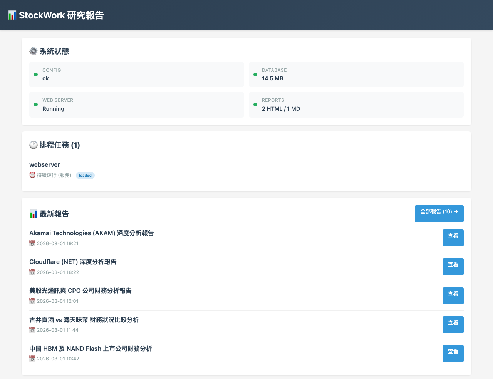
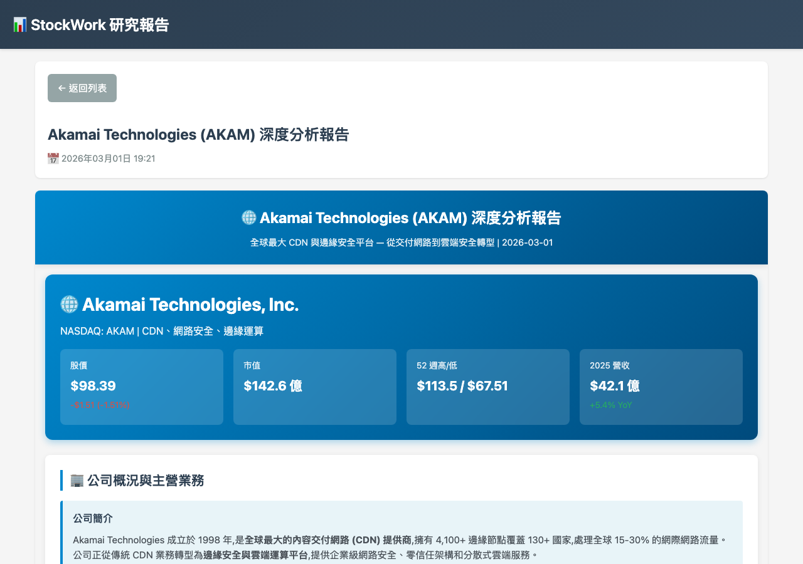
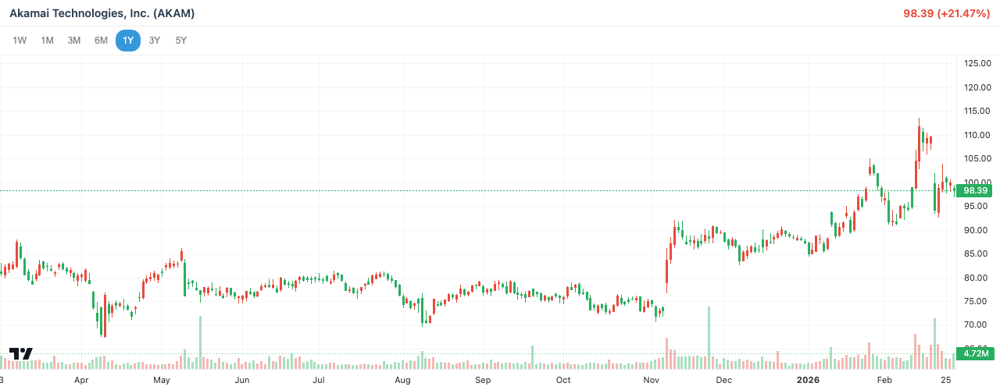
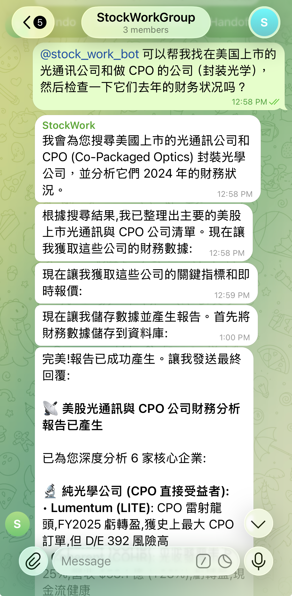
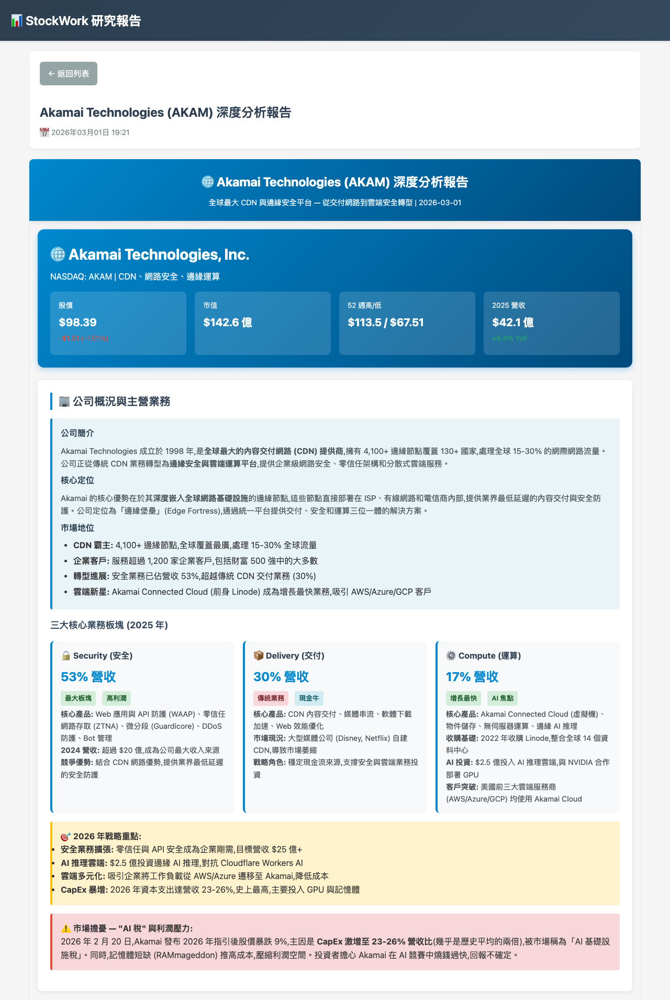
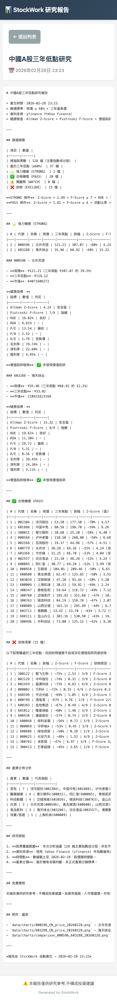

# CCStockWorkEnv

多市場股票研究與財務分析環境，由 [Claude Code](https://docs.anthropic.com/en/docs/claude-code) 驅動。透過 [Claude Telegram Bot (ctb)](https://github.com/GoatWang/claude-telegram-bot) 操作，以自然語言查詢即可產生財務報告、股票篩選與健康評分。報告呈現於內建網頁伺服器，並將連結傳送至 Telegram，直接在手機瀏覽器開啟。

## 系統架構

```
                          ┌─────────────────────────────────────────────────┐
                          │              Mac Mini Server                    │
                          │                                                 │
 ┌──────────┐   Telegram  │  ┌───────┐    ┌────────────────────────────┐   │
 │          │   Bot API   │  │  ctb  │───▶│       Claude Code          │   │
 │  User    │◀───────────▶│  │       │◀───│                            │   │
 │  Phone   │             │  └───────┘    │  CLAUDE.md + skills +      │   │
 │          │             │               │  commands + agents         │   │
 └────┬─────┘             │               │            │                │   │
      │                   │               └────────────┼────────────────┘   │
      │  click URL        │                            │                    │
      │                   │               ┌────────────▼────────────────┐   │
      │                   │               │       tool_scripts/         │   │
      │                   │               │                             │   │
      │                   │               │  market_data ──▶ yfinance   │   │
      │                   │               │                  twstock    │   │
      │                   │               │  financial_calc (Z/F-Score) │   │
      │                   │               │  db_ops ──▶ SQLite DB      │   │
      │                   │               │  report_gen ──▶ HTML       │   │
      │                   │               │  send_telegram ──▶ Bot API │   │
      │                   │               └────────────┬────────────────┘   │
      │                   │                            │ HTML                │
      │                   │                            ▼                    │
      │                   │               ┌─────────────────────┐          │
      └───────────────────┼──────────────▶│   Django Web Server │          │
                          │               │   (port 8800)       │          │
                          │               │   output/ ──▶ URL   │          │
                          │               └─────────────────────┘          │
                          └─────────────────────────────────────────────────┘

使用流程：
1. 使用者在手機 Telegram 輸入自然語言（例如「分析台積電財務狀況」）
2. ctb 將訊息轉發給 Claude Code
3. Claude Code 呼叫 tool_scripts 抓取數據、計算指標、產生 HTML 報告
4. 報告 URL 透過 Telegram 回傳給使用者
5. 使用者點擊連結，在手機瀏覽器開啟報告
```

## 開發理念

> **做一個讓我媽都知道怎麼用的 Claude Code Agent。**

這個專案的目標使用者，是完全不懂程式、不知道什麼是 Claude Code、沒聽過 CLAUDE.md / skills / commands，更不了解網路架設或網頁框架的人。他們唯一需要做的事就是：**打開手機上的 Telegram，用自然語言打一句話，然後看結果。**

例如在 Telegram 輸入「幫我查一下台積電的財務狀況」，幾秒後就會收到一個連結，點開就是一份完整的財務分析報告 — 有圖表、有數據、有評分，直接在手機瀏覽器上閱讀。

所有技術複雜度（API 呼叫、資料庫快取、報告產生、網頁伺服器）都封裝在背後，使用者不需要知道也不需要碰。

## 截圖預覽

### 首頁 — 報告列表與系統狀態



### 研究報告 — 深度分析與財務數據



### 互動式 K 線圖 — 內嵌於報告中



## 支援市場

| 市場 | 代碼 | 資料來源 | 覆蓋範圍 |
|------|------|----------|----------|
| 美國 | `US` | yfinance | 完整 |
| 台灣 | `TW` | twstock + yfinance | 完整 |
| 中國 | `CN` | yfinance | 部分（港股、主要 A 股） |

## 分析維度

涵蓋 6 大維度的深度財務研究：

- **盈利能力** — 毛利率、營業利潤率、淨利率、ROE、ROA、EPS 成長率
- **財務健康** — 負債比率、流動比率、速動比率、利息保障倍數、Altman Z-Score
- **現金流** — 營業現金流、自由現金流、現金流/淨利品質比率
- **成長性** — 營收、淨利、每股淨值年增率趨勢
- **估值** — P/E、P/B、P/S、EV/EBITDA、股息殖利率
- **品質評分** — Piotroski F-Score（0–9）、應收帳款/存貨周轉天數

## 使用範例

在 Telegram 中直接輸入自然語言或斜線指令，Claude 會自動判斷該回覆文字還是產生報告。

### 自然語言查詢（產生網頁報告）

以下為實際使用過的查詢，Claude 會產生完整 HTML 報告並回傳連結：

| 輸入的 Prompt | Claude 回覆（摘要） |
|--------------|-------------------|
| `幫我找中國A股裡再過去三年一直處於低點的股票，並檢查他們財務健康` | 📊 中國A股三年低點研究報告已產生，篩選出 37 檔標的並完成財務健康評分，其中 2 檔強力機會、20 檔合格。🔗 `<報告連結>` |
| `找美國上市的光通訊跟 CPO 公司，查看財務狀況` | 📊 美股光通訊與 CPO 公司財務分析報告已產生，已深度分析 6 家核心企業。🔗 `<報告連結>` |
| `分析 Cloudflare 的財務狀況` | 📊 Cloudflare (NET) 深度分析報告已產生，涵蓋 6 大維度 + Z-Score / F-Score。🔗 `<報告連結>` |
| `分析 Akamai 的財務狀況` | 📊 Akamai (AKAM) 深度分析報告已產生。🔗 `<報告連結>` |
| `找中國 HBM 和 NAND Flash 上市公司` | 📊 中國 HBM 及 NAND Flash 上市公司財務分析報告已產生。🔗 `<報告連結>` |

### Telegram 實際對話截圖



### 點擊連結後的報告頁面

**單股深度分析（Akamai）：**



**大規模篩選研究（中國A股三年低點）：**



### 斜線指令（快速查詢）

```
/check_price AAPL                    → 即時股價、漲跌幅
/check_price 2330 --market TW        → 台積電股價
/lookup_stock MSFT                   → 公司概況、產業、關鍵指標
/health_check NET                    → Z-Score、F-Score、財務健康評估
/compare_stocks AAPL MSFT GOOGL      → 多股並排比較報告
/screen_stocks 美國科技股 ROE>15%    → 條件篩選，產生報告
/get_financials TSLA                 → 完整財務報表
```

## 伺服器部署

如果你想將 CCStockWorkEnv 部署在 Mac Mini 上作為 24/7 運行的 Claude Code Server，可參考這篇完整教學：

**[Mac Mini as Claude Code Server — 完整架設指南](https://goatwang.github.io/posts/20260226_mac_mini_claude_code_server/)**

教學涵蓋：macOS 初始設定、SSH 遠端存取、網路設定（固定 IP / port forwarding）、Claude Code 安裝、ctb 部署等。你也可以直接請 Claude 閱讀該文章，協助你完成實體環境設定（如網路配置、防火牆規則等）。

## 環境需求

> **注意：本專案設計於 macOS 上部署運行。** 排程任務使用 macOS launchd，部分腳本依賴 macOS 環境。

- macOS（推薦 13 Ventura 或以上）
- Python >= 3.10
- [uv](https://docs.astral.sh/uv/)（Python 套件管理工具）
- [Bun](https://bun.sh) 1.0+（JavaScript runtime，ctb 使用）
- [Claude Code](https://docs.anthropic.com/en/docs/claude-code)（需先執行 `claude` 完成登入認證）
- Telegram Bot Token（透過 [@BotFather](https://t.me/BotFather) 建立）
- Telegram User ID（透過 [@userinfobot](https://t.me/userinfobot) 取得）

## 前置準備：取得 Telegram Bot Token 與 Chat ID

在安裝前，你需要先從 Telegram 取得兩個東西：**Bot Token**（讓程式控制你的 Bot）和 **Chat ID**（讓程式知道要把訊息送到哪裡）。

### 建立 Telegram Bot 並取得 Bot Token

1. 在 Telegram 搜尋 **[@BotFather](https://t.me/BotFather)** 並開啟對話
2. 輸入 `/newbot`
3. BotFather 會要求你輸入 Bot 的**顯示名稱**（例如 `CCStockWorkEnv 研究助手`）
4. 接著輸入 Bot 的 **username**，必須以 `bot` 結尾（例如 `ccstockworkenv_research_bot`）
5. 建立成功後，BotFather 會回傳一串 **Bot Token**，格式像這樣：
   ```
   1234567890:AAHxxxxxxxxxxxxxxxxxxxxxxxxxxxxx
   ```
6. 把這串 Token 記下來，稍後要填入 `config.json` 和 ctb 的 `.env`

### 取得你的 Chat ID（或 Group Chat ID）

**個人 Chat ID：**

1. 在 Telegram 搜尋 **[@userinfobot](https://t.me/userinfobot)** 並開啟對話
2. 輸入任意訊息（例如 `/start`）
3. Bot 會回覆你的 User ID，格式是一串數字（例如 `123456789`）

**群組 Chat ID（如果要在群組中使用）：**

1. 先把你的 Bot 加入群組
2. 在群組中輸入任意訊息
3. 在瀏覽器開啟：`https://api.telegram.org/bot<你的BOT_TOKEN>/getUpdates`
4. 在 JSON 回應中找到 `"chat":{"id":-100xxxxxxxxxx}`，負數開頭的就是群組 Chat ID

## 安裝步驟

### 1. 安裝 Claude Telegram Bot (ctb)

ctb 是連接 Claude Code 與 Telegram 的橋梁，讓你可以在手機上透過自然語言操作 CCStockWorkEnv。

**方法一：從原始碼編譯（推薦）**

```bash
git clone https://github.com/GoatWang/claude-telegram-bot.git
cd claude-telegram-bot
bun install
bun build --compile src/cli/index.ts --outfile /usr/local/bin/ctb
```

**方法二：從原始碼直接執行**

```bash
git clone https://github.com/GoatWang/claude-telegram-bot.git
cd claude-telegram-bot
cp .env.example .env
# 編輯 .env，填入 TELEGRAM_BOT_TOKEN 和 TELEGRAM_ALLOWED_USERS
bun install
bun run start
```

**設定 ctb 環境變數：**

建立 `.env` 檔案（在 claude-telegram-bot 目錄下）：

```env
TELEGRAM_BOT_TOKEN=1234567890:ABC-DEF...    # 從 @BotFather 取得
TELEGRAM_ALLOWED_USERS=123456789             # 你的 Telegram User ID
```

### 2. 複製 CCStockWorkEnv 專案

```bash
git clone https://github.com/YOUR_USERNAME/CCStockWorkEnv.git
cd CCStockWorkEnv
```

### 3. 安裝依賴套件

```bash
uv sync
```

### 4. 設定機密資訊

```bash
cp config.json.template config.json
```

編輯 `config.json`，填入你的憑證：
- `telegram.bot_token` — Telegram Bot API token
- `telegram.chat_ids` — 接收通知的 Telegram chat ID
- `email.*` — Mailgun API 憑證（選填）
- `web_server.fixed_ip` — 伺服器公開 IP，用於報告 URL（選填，見下方說明）

> **關於 `fixed_ip`：** 如果你有公網固定 IP 或域名，填入後報告 URL 會使用該 IP，讓手機可以從外網存取。如果留空，報告 URL 會使用 `localhost`，僅限區域網路內存取，且 Claude 會在回覆中提醒使用者此限制。

### 5. 初始化資料庫

```bash
cd tool_scripts/db_ops && uv run python db_manager.py --init
```

### 6. 啟動網頁伺服器

```bash
cd tool_scripts/web_server && bash start_server.sh
```

### 7. 透過 ctb 啟動

```bash
ctb /path/to/CCStockWorkEnv
```

ctb 會載入專案的 `CLAUDE.md`、`.claude/commands/`、`.claude/skills/` 和 `.claude/agents/`，讓 Claude Code 具備 CCStockWorkEnv 的完整功能。

---

## 開發者參考

以下內容供想要了解內部實作或參與開發的人參考。

### 報告產生

- 行動裝置優先的響應式 HTML，內嵌互動式 K 線圖
- 透過 Django 網頁伺服器發布，以 URL 推送至 Telegram
- 指標表格以顏色標示（綠色=良好、黃色=注意、紅色=警示）

### 研究快取

快取優先工作流程，避免大規模篩選時重複呼叫 API：

| 資料類型 | 最大快取時間 | 說明 |
|----------|-------------|------|
| `financials` | 90 天 | 配合季報週期 |
| `metrics` | 24 小時 | 依賴即時股價的比率 |
| `company_info` | 180 天 | 公司資訊鮮少變動 |

### 專案架構

```
CCStockWorkEnv/
├── .claude/
│   ├── commands/          # 14 個斜線指令
│   ├── skills/            # 8 個領域知識檔案
│   └── agents/            # 2 個專業代理
├── tool_scripts/
│   ├── market_data/       # API 抽象層（base → US/TW/CN → factory）
│   ├── financial_calc/    # Z-Score、F-Score、比率、篩選器
│   ├── db_ops/            # SQLite CRUD（股票、價格、財務、快取）
│   ├── report_gen/        # HTML 報告與圖表產生
│   ├── web_server/        # Django 5.1 報告檢視器（port 8800）
│   ├── send_telegram/     # Telegram 訊息發送
│   └── send_mail/         # Mailgun Email 發送
├── schedules/             # 排程任務腳本（launchd）
├── prompts/               # 研究記錄（YYYYMMDD_N_description.md）
├── data/                  # SQLite DB、日誌、匯出檔（gitignored）
└── output/                # 產生的 HTML 報告（gitignored）
```

### API 抽象層

```
MarketDataFetcher (ABC)
├── USFetcher    [yfinance]
├── TWFetcher    [twstock + yfinance]
└── CNFetcher    [yfinance]

fetcher_factory.py → get_fetcher("US") → USFetcher
```

### 排程任務

定期執行的任務使用 macOS launchd，詳細 SOP 請參閱 `.claude/skills/scheduler_sop.md`。

- 腳本：`schedules/<task_name>.sh`
- Plist：`~/Library/LaunchAgents/com.ccstockworkenv.<task_name>.plist`
- 日誌：`data/logs/<task_name>.log`

### 斜線指令一覽（14 個）

除了自然語言查詢，ctb 也支援斜線指令，Claude 內部會自動調用對應的 skill。

| 指令 | 說明 |
|------|------|
| `/check_price` | 查詢即時股價、漲跌幅、成交量 |
| `/lookup_stock` | 查詢公司概況、產業、關鍵指標 |
| `/get_financials` | 查看財務報表（損益表、資產負債表、現金流量表） |
| `/health_check` | 財務健康檢查：Z-Score、F-Score、關鍵比率與綜合評估 |
| `/compare_stocks` | 2–5 檔股票並排比較 |
| `/screen_stocks` | 以自然語言設定條件篩選股票 |
| `/gen_report` | 產生行動裝置友善的 HTML 研究報告 |
| `/download_data` | 批次下載市場數據至 SQLite |
| `/update_db` | 增量更新每日股價 |
| `/send_report_html` | 發送 HTML 報告至 Telegram |
| `/send_telegram` | 發送 Telegram 訊息 |
| `/send_email` | 透過 Mailgun 發送 Email |
| `/review_prompt` | 產生結構化程式碼審查提示 |
| `/debug_prompt` | 產生結構化除錯提示 |

## 免責聲明

本專案所有分析僅供研究與教育用途，不構成投資建議。投資決策前請務必自行進行盡職調查。
